# zadt

ABAP Development Tools protocol for the Ziege framework.

## Background

ABAP Development Tools are more than an Eclipse plugin. The application server
exposes an HTTP API for working with repository objects stored on the system.
ZADT provides typed operations and runtime dispatch for that API.

## Getting started

### Basics

Create a typed reference from the collection advertised by discovery:

```rust,ignore
let class = client.object::<Class>("ZCL_DEMO")?;
```

Only primary object types can be constructed directly from a discovery
collection. Subobjects are constructed through a parent reference and the URI
templates advertised by that parent's collection:

```rust,ignore
let group = client.object::<FunctionGroup>("Z_GROUP")?;
let module = group.subobject::<FunctionModule>("Z_FUNCTION")?;
```

Operations that only need object identity can use the reference directly:

```rust,ignore
let activation_result = class.activation().execute(&client).await?;
```

Source navigation requires loaded properties because ADT advertises source URIs in
the object representation:

```rust,ignore
let class = class.query().execute(&client).await?;
let source = class.source()?.query().execute(&client).await?;
```

ADT identities are represented as resource handles. Handles expose operations
naturally associated with their context, while operation values remain independently
composable and executable.

`Class` is a nominal object-family marker. Loaded classes use
`ObjectSnapshot<Class>`, which contains `ClassProperties` and the response metadata.
Static capabilities come from traits such as `Source` implemented by the marker.
Loaded properties determine which concrete source resources are available, letting
ZAFF project modern and legacy class layouts without guessing paths.

`ObjectType` contains the common property and Workbench-type contract used by
all exact object references. `PrimaryObjectType` adds top-level collection
addressing, while `SubObjects<C>` records the parent-child combinations accepted
by the typed API. Once any object has a concrete `ObjectRef`, ordinary query,
lock, update, source, and activation operations continue to use the common
`ObjectType` contract.

### Object model and capabilities

```mermaid
---
config:
  theme: base
  themeVariables:
    fontFamily: Inter, ui-sans-serif, system-ui, sans-serif
    lineColor: '#64748b'
    textColor: '#0f172a'
    clusterBkg: '#ffffff'
    clusterBorder: '#cbd5e1'
  flowchart:
    curve: stepAfter
    padding: 14
    nodeSpacing: 24
    rankSpacing: 42
  layout: elk
---
flowchart TB
    subgraph DEFINITION["Object declaration"]
        direction TB
        DECLARATION["<strong>Type declaration</strong><br>#[object_type(<br>properties = ClassProperties,<br>capabilities(Source, Run, ...)<br>)]<br>pub struct Class;"]
        FAMILY["Generated Class family<br>ObjectType<br>ClassProperties + XmlConversion / MediaTyped"]

        subgraph MARKERS["Marker traits"]
            direction LR
            PRIMARY["PrimaryObjectType"]
            RUN["ImmediateRun"]
        end

        DECLARATION --> FAMILY
        FAMILY --> PRIMARY
        FAMILY --> RUN
    end

    subgraph BOUNDS["Static API requirements"]
        direction LR
        CREATE["create()<br>T: Create"]
        SOURCE["source()<br>T: Source"]
        IDENTITY["lock() / activation()<br>no family capability bound"]
    end

    subgraph SURFACES["Generated API"]
        direction LR

        subgraph STATIC["Static dispatch"]
            direction TB
            CAPABILITIES["Capability implementations<br>Source / Create / Structure / ImmediateRun"]
            TYPED_CALL["ObjectRef&lt;Class&gt;<br>direct static call"]
        end

        subgraph DYNAMIC["Dynamic dispatch"]
            direction TB
            DESCRIPTOR["Class::DESCRIPTOR<br>ObjectTypeDescriptor"]
            REGISTRY["OBJECT_TYPES registry<br>concrete descriptor table"]
            RUNTIME_CALL["ErasedObject<br>descriptor function pointers"]
        end
    end

    subgraph RESULTS["Type-state-specific results"]
        direction LR
        TYPED_OBJECT["ObjectSnapshot&lt;Class&gt;<br>ClassProperties"]
        RUNTIME_OBJECT["ErasedObject<br>type-erased properties"]
    end

    subgraph EXECUTION["Shared execution layer"]
        direction LR
        EXECUTOR["Client or UserSession"]
        ENCODED["EncodedOperation&lt;Owned / Advertised&gt;"]
        REQUEST["AdtRequest"]
        TRANSPORT["Transport"]
        SAP["SAP ADT API"]
    end

    FAMILY --> BOUNDS
    FAMILY --> CAPABILITIES
    FAMILY --> DESCRIPTOR

    CREATE --> CAPABILITIES
    SOURCE --> CAPABILITIES
    IDENTITY --> TYPED_CALL
    PRIMARY --> CAPABILITIES
    RUN --> CAPABILITIES
    CAPABILITIES -->|exposes methods on| TYPED_CALL

    DESCRIPTOR -->|registered in| REGISTRY
    REGISTRY -->|selected by Workbench type| RUNTIME_CALL
    DESCRIPTOR -->|forwards to static trait implementations| CAPABILITIES

    TYPED_CALL --> LOGIC["Shared typed methods<br>operation encoding<br>relation resolution<br>response decoding"]
    RUNTIME_CALL -->|adapter downcasts properties to ClassProperties| LOGIC
    LOGIC -->|typed caller preserves T| TYPED_OBJECT
    LOGIC -->|descriptor erases properties| RUNTIME_OBJECT

    ENCODED --> EXECUTOR
    EXECUTOR -->|resolves target| REQUEST
    REQUEST --> TRANSPORT
    TRANSPORT --> SAP
    LOGIC --> ENCODED

    DECLARATION@{ shape: event }
    FAMILY@{ shape: rounded }
    LOGIC@{ shape: rounded }

    classDef declaration fill:#1e293b,color:#ffffff,stroke:#475569,stroke-width:2px
    classDef accent fill:#f1f5f9,color:#0f172a,stroke:#64748b,stroke-width:1.5px
    classDef node fill:#ffffff,color:#0f172a,stroke:#94a3b8
    classDef muted fill:#f8fafc,color:#334155,stroke:#94a3b8
    classDef backend fill:#334155,color:#ffffff,stroke:#475569,stroke-width:2px

    class DECLARATION declaration
    class FAMILY,PRIMARY,RUN accent
    class CREATE,SOURCE,IDENTITY,CAPABILITIES,TYPED_CALL,DESCRIPTOR,REGISTRY,RUNTIME_CALL node
    class TYPED_OBJECT,RUNTIME_OBJECT,LOGIC,ENCODED,REQUEST,EXECUTOR,TRANSPORT muted
    class SAP backend

    style DEFINITION fill:#f8fafc,stroke:#cbd5e1,color:#334155
    style BOUNDS fill:#ffffff,stroke:#cbd5e1,color:#334155
    style MARKERS fill:#ffffff,stroke:#cbd5e1,color:#334155
    style STATIC fill:#ffffff,stroke:#cbd5e1,color:#334155
    style DYNAMIC fill:#ffffff,stroke:#cbd5e1,color:#334155
    style SURFACES fill:#ffffff,stroke:#cbd5e1,color:#334155
    style RESULTS fill:#ffffff,stroke:#cbd5e1,color:#334155
    style EXECUTION fill:#ffffff,stroke:#cbd5e1,color:#334155
```



The typed path exposes only methods supported by the marker's capability traits.
The runtime path starts from the exact Workbench type stored in `ObjectRef<()>`,
selects a descriptor from the registry, and downcasts the internally type-erased
properties through the same concrete marker and property type. Both paths call the
same typed methods, produce the same transport-neutral requests, and use the same
executors.

### Runtime descriptors

Runtime object types use `ObjectRef<()>`. A modeled runtime reference can load an
`ErasedObject` with concrete type-erased properties. ZADT selects a registered
descriptor from the exact Workbench type and validates capabilities at runtime.
Consumers export JSON with `ErasedObject::properties` and submit edited JSON to
`ErasedObject::update`. Loaded snapshots remain immutable, and internal capability
dispatch does not convert properties through JSON.

Typed operations dispatch through Rust traits. Runtime operations dispatch through
descriptors and return explicit errors when an object type does not support an operation.

### Transport

ZADT uses a transport trait around ADT requests and responses. Custom transports are
supported. The provided implementation uses HTTP through `reqwest`.
