# zadt

ABAP Development Tools protocol for the Ziege framework.

## Background

ABAP Development Tools are more than an Eclipse plugin. The application server
exposes an HTTP API for working with repository objects stored on the system.
ZADT provides typed operations and runtime dispatch for that API.

## Getting started

### Basics

Create a typed reference from the collection advertised by discovery:

```rust,ignore
let class = client.object::<Class>("ZCL_DEMO")?;
```

Operations that only need object identity can use the reference directly:

```rust,ignore
let activation_result = class.activation().execute(&client).await?;
```

Source navigation requires loaded properties because ADT advertises source URIs in
the object representation:

```rust,ignore
let class = class.query().execute(&client).await?;
let source = class.source()?.query().execute(&client).await?;
```

System users are identity handles that can create user-scoped operations. A user
loaded from the system directory also carries its display name:

```rust,ignore
let mut query = client.users();
query.query("*DEV*").max_count(20);
let users = query.execute(&client).await?;

let user = &users.users[0];
let transports = user.transports().execute(&client).await?;
let favorites = user.favorites().execute(&client).await?;
```

`Class` is a nominal object-family marker. Loaded classes use `Object<Class>`, which
contains `ClassProperties` and the response metadata. Static capabilities come from
traits such as `Source` implemented by the marker. Loaded properties determine which
concrete source resources are available, letting ZAFF project modern and legacy class
layouts without guessing paths.

### Object model and capabilities

```mermaid
---
config:
  theme: base
  themeVariables:
    fontFamily: Inter, ui-sans-serif, system-ui, sans-serif
    lineColor: '#64748b'
    textColor: '#0f172a'
    clusterBkg: '#ffffff'
    clusterBorder: '#cbd5e1'
  flowchart:
    curve: stepAfter
    padding: 14
    nodeSpacing: 24
    rankSpacing: 42
  layout: elk
---
flowchart TB
    subgraph DEFINITION["Object declaration"]
        direction TB
        DECLARATION["<strong>Type declaration</strong><br>#[object_type(<br>properties = ClassProperties,<br>capabilities(Source, Run, ...)<br>)]<br>pub struct Class;"]
        FAMILY["Generated Class family<br>ObjectType<br>ClassProperties + PropertyModel"]

        subgraph MARKERS["Marker traits"]
            direction LR
            UPDATE["UpdateProperties"]
            RUN["ImmediateRun"]
        end

        DECLARATION --> FAMILY
        FAMILY --> UPDATE
        FAMILY --> RUN
    end

    subgraph BOUNDS["Static API requirements"]
        direction LR
        CREATE["create()<br>T: Create"]
        SOURCE["source()<br>T: Source"]
        IDENTITY["lock() / activation()<br>no family capability bound"]
    end

    subgraph SURFACES["Generated API"]
        direction LR

        subgraph STATIC["Static dispatch"]
            direction TB
            CAPABILITIES["Capability implementations<br>Source / Create / UpdateProperties / ImmediateRun"]
            TYPED_CALL["ObjectRef&lt;Class&gt;<br>direct static call"]
        end

        subgraph DYNAMIC["Dynamic dispatch"]
            direction TB
            DESCRIPTOR["Class::DESCRIPTOR<br>ObjectTypeDescriptor&lt;Class&gt;"]
            REGISTRY["OBJECT_TYPES registry<br>dyn RuntimeObjectTypeDescriptor"]
            RUNTIME_CALL["ObjectRef&lt;()&gt;<br>descriptor()"]
        end
    end

    subgraph RESULTS["Type-state-specific results"]
        direction LR
        TYPED_OBJECT["Object&lt;Class&gt;<br>ClassProperties"]
        RUNTIME_OBJECT["AnyObject<br>serde_json::Value"]
    end

    subgraph EXECUTION["Shared execution layer"]
        direction LR
        EXECUTOR["Client or UserSession"]
        REQUEST["AdtRequest"]
        TRANSPORT["Transport"]
        SAP["SAP ADT API"]
    end

    FAMILY --> BOUNDS
    FAMILY --> CAPABILITIES
    FAMILY --> DESCRIPTOR

    CREATE --> CAPABILITIES
    SOURCE --> CAPABILITIES
    IDENTITY --> TYPED_CALL
    UPDATE --> CAPABILITIES
    RUN --> CAPABILITIES
    CAPABILITIES -->|exposes methods on| TYPED_CALL

    DESCRIPTOR -->|registered in| REGISTRY
    REGISTRY -->|selected by Workbench type| RUNTIME_CALL
    DESCRIPTOR -->|forwards to static trait implementations| CAPABILITIES

    TYPED_CALL --> LOGIC["Shared monomorphized logic<br>request construction<br>XML / JSON conversion<br>response decoding"]
    RUNTIME_CALL -->|vtable forwards with T = Class| LOGIC
    LOGIC -->|typed caller preserves T| TYPED_OBJECT
    LOGIC -->|descriptor erases properties| RUNTIME_OBJECT

    REQUEST --> EXECUTOR
    EXECUTOR --> TRANSPORT
    TRANSPORT --> SAP
    LOGIC --> REQUEST

    DECLARATION@{ shape: event }
    FAMILY@{ shape: rounded }
    LOGIC@{ shape: rounded }

    classDef declaration fill:#1e293b,color:#ffffff,stroke:#475569,stroke-width:2px
    classDef accent fill:#f1f5f9,color:#0f172a,stroke:#64748b,stroke-width:1.5px
    classDef node fill:#ffffff,color:#0f172a,stroke:#94a3b8
    classDef muted fill:#f8fafc,color:#334155,stroke:#94a3b8
    classDef backend fill:#334155,color:#ffffff,stroke:#475569,stroke-width:2px

    class DECLARATION declaration
    class FAMILY,UPDATE,RUN accent
    class CREATE,SOURCE,IDENTITY,CAPABILITIES,TYPED_CALL,DESCRIPTOR,REGISTRY,RUNTIME_CALL node
    class TYPED_OBJECT,RUNTIME_OBJECT,LOGIC,REQUEST,EXECUTOR,TRANSPORT muted
    class SAP backend

    style DEFINITION fill:#f8fafc,stroke:#cbd5e1,color:#334155
    style BOUNDS fill:#ffffff,stroke:#cbd5e1,color:#334155
    style MARKERS fill:#ffffff,stroke:#cbd5e1,color:#334155
    style STATIC fill:#ffffff,stroke:#cbd5e1,color:#334155
    style DYNAMIC fill:#ffffff,stroke:#cbd5e1,color:#334155
    style SURFACES fill:#ffffff,stroke:#cbd5e1,color:#334155
    style RESULTS fill:#ffffff,stroke:#cbd5e1,color:#334155
    style EXECUTION fill:#ffffff,stroke:#cbd5e1,color:#334155
```



The typed path exposes only methods supported by the marker's capability traits.
The runtime path starts from the exact Workbench type stored in `ObjectRef<()>`,
selects a descriptor from the registry, and forwards erased JSON values through the
same concrete marker and property model. Both paths produce the same transport-neutral
requests and use the same executors.

### Runtime descriptors

Runtime object types use `ObjectRef<()>`. A modeled runtime reference can load an
`AnyObject` with JSON properties. ZADT selects a registered descriptor from the
exact Workbench type and validates capabilities at runtime.

Typed operations dispatch through Rust traits. Runtime operations dispatch through
descriptors and return explicit errors when an object type does not support an operation.

### Transport

ZADT uses a transport trait around ADT requests and responses. Custom transports are
supported. The provided implementation uses HTTP through `reqwest`.
