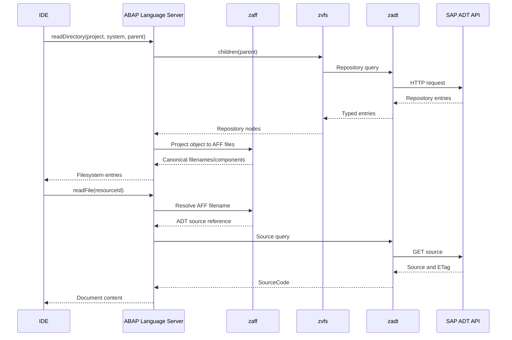

# zaff

Bidirectional ABAP File Formats projection.

`zaff` maps repository objects from `zadt`/`zvfs` to editor-facing files and
maps those files back to their logical ADT components. It owns the transformations
between ADT models and AFF schemas, including merging an edited AFF document
back into the original ADT properties so fields outside the AFF schema are
preserved.

## Projection

The following example shows `zaff` used through LSP orchestration. The language
server coordinates repository traversal, AFF projection, and ADT operations.

Metadata files are properties-backed rather than source-backed. The consumer
queries the projected `ObjectRef<()>` to obtain `AnyObject`, then
uses `ProjectedFile::render_properties` and `ProjectedFile::merge_properties`.
The file's registered family codec validates and transforms the runtime JSON
through its concrete ZADT property model. Merging retains the original media
type, ETag, and ADT fields that the AFF schema does not represent.

`DTEL/DE` projects to `<name>.dtel.json`, `CLAS/OC` to `<name>.clas.json`, and
both `PROG/P` and standalone `PROG/I` to `<name>.prog.json`. Standalone Includes
use AFF's shared Program schema with the required `programType: "include"`
discriminator. Each family owns its file descriptors and codecs; the central
registry only enumerates those descriptors.

# Limitations

Path resolution identifies an AFF family and component, not a globally unique
remote object. A consumer should retain the `RepositoryObjectEntry` from which
the projected `ObjectRef<()>` originated. That index disambiguates
representations such as `PROG/P` and `PROG/I`, which share the same `.prog.*`
file layout, and keeps the SAP system, package, URI, and object version attached
to edits.

Optional class includes and language-dependent property files are exposed as
possible `FileSpec`s. The projection consumer decides which concrete files to
publish based on resources available from the backend. `project` returns files
that currently have a content backing; text codecs remain available only as
specifications.

Some valid AFF metadata has no field in the currently modeled ADT properties.
Class component descriptions and the Program status, variant, authorization,
application, and logical-database fields are accepted and validated as AFF, but
non-default edits are rejected until an ADT backing for those fields is modeled.

# Challenges
Legacy CLAS objects have no testclasses, macros, implementations and definitions include.
Instead, they have a `localtypes` include that modern classes do not have. This implies
that it isnt possible to correctly expand the classes without fetching the object properties
before that, which incurs I/O that technically does not belong into the projection layer.
