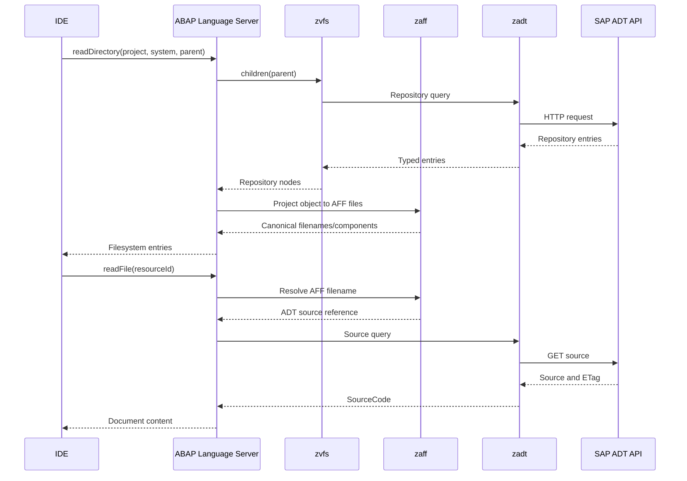

# zaff

Bidirectional ABAP File Formats projection.

`zaff` maps repository objects from `zadt`/`zvfs` to editor-facing files and
maps those files back to their logical ADT components It owns the transformations
between ADT models and AFF schemas, including merging an edited AFF document
back into the original ADT properties so fields outside the AFF schema are
preserved.

## Projection 

The following example shows `zaff` used through LSP orchestration. The language
server coordinates repository traversal, AFF projection, and ADT operations.

# Limitations

Path resolution identifies an AFF family and component, not a globally unique
remote object. A language server should retain the `RepositoryObjectEntry` used
to project every concrete path. That index disambiguates representations such
as `PROG/P` and `PROG/I`, which share the same `.prog.*` file layout, and keeps
the SAP system, package, URI, and object version attached to edits.

Optional class includes and language-dependent property files are exposed as
possible `FileSpec`s. The projection consumer decides which concrete files to
publish based on resources available from the backend.

# Challenges
Legacy CLAS objects have no testclasses, macros, implementations and definitions include.
Instead, they have a `localtypes` include that modern classes do not have. This implies
that it isnt possible to correctly expand the classes without fetching the object properties
before that, which incurs I/O that technically does not belong into the projection layer.

